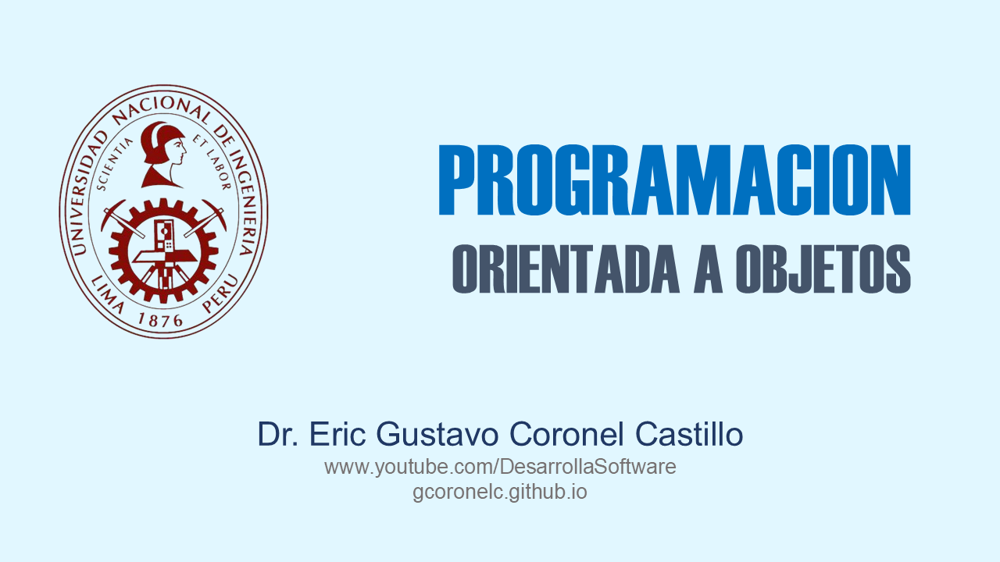

# DATOS GENERALES

- Lugar: UNIVERSIDAD NACIONAL DE INGENIERIA
- Horario: Lunes de 08:00-13:00 Horas
- Inicio: 31-AGO-2026
- Portal web: https://www.fiis.uni.edu.pe/
- Dirección: https://goo.gl/maps/SGR2RiuPjonfqSM87

# DOCENTE

- Docente: Dr. ERIC GUSTAVO CORONEL CASTILLO
- Blog: https://gcoronelc.blogspot.com/
- Canal Youtube: https://www.youtube.com/DesarrollaSoftware
- Cursos Virtuales: http://gcoronelc.github.io

# DELEGADOS

## Delegado

- Nombre: 
- Correo: 

## Subdelegado

- Nombre: 
- Correo: 

# RECURSOS UTILES

- CURSOS VIRTUALES: https://n9.cl/cursos-virtuales
- CURSOS VIRTUALES: https://cognitiveclass.ai/courses
- JAVA FUNDAMENTOS: https://n9.cl/gcoronelc-fdp-java
- JAVA OO: https://bit.ly/2FCowSU
- JDBC: https://bit.ly/2TaHisH
- PL/SQL: https://bit.ly/2uvE9cF
- C++: https://n9.cl/gcoronelc-cpp
- ORCLE: https://bit.ly/2QZIBbf
- JAVA WEB CON ORACLE: https://bit.ly/36D6njZ
- WS SOAP EJEMPLO 1: https://bit.ly/2Rd7osH
- WS SOAP EJEMPLO 2: https://bit.ly/39PalrT

